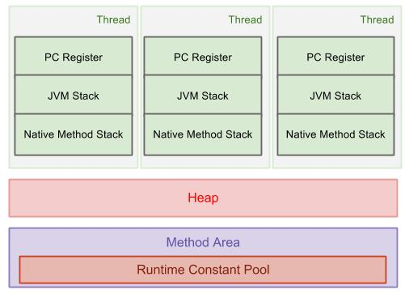

# jvm memory

## JVM Architecture, Memory Areas

### Thread States and Memory Areas:

A thread can be in only one state at a given point in time. These states are virtual machine states which do not reflect any operating system thread states [NEW, RUNNABLE, BLOCKED, WAITING, TIMED_WAITING, TERMINATED].



Java8 Update: PermGen is replaced with Metaspace which is very similar. Main difference is that Metaspace re-sizes dynamically i.e., It can expand at runtime. Java Metaspace space: unbounded (default)

The Heap is divided into young and old generations as follows :

## Memory Areas
Java Heap Memory is part of memory allocated to JVM by Operating System. Whenever we create objects they are created inside [heap in java][http://www.oracle.com/webfolder/technetwork/tutorials/obe/java/gc01/index.html].

Java Heap space is divided into three regions or generation for sake of garbage collection called Young Generation, Old or tenured Generation and Permanent Generation. Permanent generation is garbage collected during full gc in hotspot JVM

The Young Generation is where all new objects are allocated and aged. When the young generation fills up, this causes a minor garbage collection. A young generation full of dead objects is collected very quickly. Some surviving objects are aged and eventually move to the old generation.

The Old Generation is used to store long surviving objects. Typically, a threshold is set for young generation object and when that age is met, the object gets moved to the old generation. Eventually the old generation needs to be collected. This event is called a major garbage collection.

The Permanent generation contains metadata required by the JVM to describe the classes and methods used in the application. The permanent generation is populated by the JVM at runtime based on classes in use by the application.

PermGen has been replaced with Metaspace since Java 8 release. PermSize & MaxPermSize parameters will be ignored now. Have a look this [dzone article][https://dzone.com/articles/java-8-permgen-metaspace] by Pierre - Hugues Charbonneau to understand about Metaspace.

enter image description here

Image source:http://www.oracle.com/webfolder/technetwork/tutorials/obe/java/gc01/index.html

Refer to same article for more details.

https://docs.oracle.com/javase/6/docs/technotes/guides/management/jconsole.html
As of Java 8, the PermGen space has been replaced with Metaspace.

http://stackoverflow.com/a/3849819/5081877

## 1. 什么是JVM?
 JVM就是所谓的Java虚拟机，
## 2. JVM内存划分
我们在编写程序时，经常会遇到OOM（out of Memory）以及内存泄漏等问题。为了避免出现这些问题，我们首先必须对JVM的内存划分有个具体的认识。JVM将内存主要划分为：方法区、虚拟机栈、本地方法栈、堆、程序计数器。JVM运行时数据区如下：


### 程序计数器：
【我的理解】很好理解嘛。每一个线程都需要一个计数器记录它当前执行的字节，而程序计数器就是线程当前正在运行的字节码的行号指示器。

程序计数器是线程私有的区域，很好理解嘛~，每个线程当然得有个计数器记录当前执行到那个指令。占用的内存空间小，可以把它看成是当前线程所执行的字节码的行号指示器。如果线程在执行Java方法，这个计数器记录的是正在执行的虚拟机字节码指令地址；如果执行的是Native方法，这个计数器的值为空（Undefined）【不理解！！！why】。此内存区域是唯一一个在Java虚拟机规范中没有规定任何OutOfMemoryError情况的区域。


### 虚拟机栈
【我的理解】：Java虚拟机栈就是专为Java程序中的方法服务的，属于线程私有。每调用一次方法，就想到于创建了一个栈帧，这个栈帧中存放着方法的局部变量等一些信息，调用方法就是栈帧的入栈和出栈。入栈为调用函数，出栈（删除栈顶）为函数调用结束。

注意这个区域可能出现的两种异常：一种是StackOverflowError，当前线程请求的栈深度大于虚拟机所允许的深度时，会抛出这个异常。制造这种异常很简单：将一个函数反复递归自己，最终会出现栈溢出错误（StackOverflowError）。另一种异常是OutOfMemoryError异常，当虚拟机栈可以动态扩展时（当前大部分虚拟机都可以），如果无法申请足够多的内存就会抛出OutOfMemoryError，如何制作虚拟机栈OOM呢，参考一下代码：

````java

public void stackLeakByThread(){
    while(true){
        new Thread(){
            public void run(){
                while(true){
                }
            }
        }.start()
    }
}
````

这段代码有风险，可能会导致操作系统假死，请谨慎使用~~~

### 本地方法栈（Native method）
【我的理解】本地方法栈专为非Java语言编写的程序服务，比如C++,C语言的程序接口。

### Java堆
【我的理解】Java堆可以说是虚拟机中最大一块内存了。它是所有线程所共享的内存区域，几乎所有的实例对象都是在这块区域中存放。当然，睡着JIT编译器的发展，所有对象在堆上分配渐渐变得不那么“绝对”了。

Java堆是垃圾收集器管理的主要区域。由于现在的收集器基本上采用的都是分代收集算法，所有Java堆可以细分为：新生代和老年代。在细致分就是把新生代分为：Eden空间、From Survivor空间、To Survivor空间。当堆无法再扩展时，会抛出OutOfMemoryError异常。

关键词：实例对象，垃圾处理，线程共享

### 方法区
方法区存放的是类信息、常量、静态变量等。方法区是各个线程共享区域，很容易理解，我们在写Java代码时，每个线程度可以访问同一个类的静态变量对象。由于使用反射机制的原因，虚拟机很难推测那个类信息不再使用，因此这块区域的回收很难。另外，对这块区域主要是针对常量池回收，值得注意的是JDK1.7已经把常量池转移到堆里面了。同样，当方法区无法满足内存分配需求时，会抛出OutOfMemoryError。 制造方法区内存溢出，注意，必须在JDK1.6及之前版本才会导致方法区溢出，原因后面解释,执行之前，可以把虚拟机的参数-XXpermSize和-XX：MaxPermSize限制方法区大小。

## Java内存效率

[这篇文章](http://www.ibm.com/developerworks/java/library/j-codetoheap/index.html)里详细的介绍了JVM中各种数据类型/集合对内存的使用情况。

**总的来说:**

1. JVM是非常浪费内存的；

1. 并且和CPU资源不同，这种浪费，并不能通过JVM自动优化（CPU优化有JIT，内联等技术）

1. 只能通过小心的使用以及切换到高内存效率的库来实现。


### JVM内存浪费在哪里

下图是32位机器中JVM进程的内存地址分布(4G)


#### 1. Object

没错，Object是JVM中一切内存浪费的根源


上图是32位JVM中一个Integer对象的内存占用情况，这个对象共占用128bit内存，其中只有32bit是真正的int数据. 其他的部分：

1. Class pointer: 指向对象对应的类信息(Class Info)的指针，也就是我们平时用的obj.getClass()
1. Flags: 各种标志位，包括对象的hashcode，对象是否为数组等信息
1. Lock: 对象对应的锁，用于synchronized

这三类信息是**每一个**对象都要存储的，但却不都是真正有用的数据。

结论：Integer对象，内存的使用效率是 1/4

#### 2. 数组

数组比普通的对象多一个size字段，如图：


int[]数组的存储使用率是 1/5，注意这是size==1的情况。如果有更多的数据，int[]数组的内存使用率会提高。

但是Integer[]数组不会

#### 3. String

String的存储大致如下：

````java
class String {
    int count;
    int offset;
    char[] value;
}
````


内存分布如下图：


#### 4. 集合


#### 5. 集合的空余空间

#### 6. 自动可变长


## 解决方案：

### 优化小集合
1. 初始化时指定合理的size
1. 减少对象的层次

### 使用高性能的集合/库

##### 1. `int[]` < `Integer[]` < `ArrayList<Integer>` < `Set<Integer>` < `Map<Integer, Integer>`

##### 2. [Trove](http://trove.starlight-systems.com/)

各种原始类型数据的集合：TIntList, TIntIntMap等，接口和java.util里的集合差不多，但是更高效，并且节省大量内存

##### 3. [Javolution](http://javolution.org/)

> Javolution real-time goals are simple: To make your application faster and more time predictable!

一个高性能的实时计算库，实时版的 util / lang / text / io / xml

##### 4. Guava

### 减少抽象的层次

### 注意不必要的浪费
1. ConcurrentCollection
