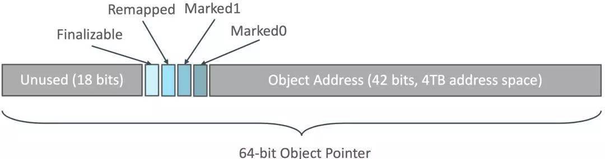
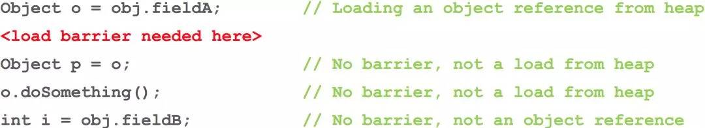

# 一些前沿的技术，权当拓宽视野吧

## GraalVM 神什么
> GraalVM is a universal virtual machine for running applications written in JavaScript, Python 3, Ruby, R, JVM-based languages like Java, Scala, Kotlin, and LLVM-based languages such as C and C++.

> GraalVM removes the isolation between programming languages and enables interoperability in a shared runtime. It can run either standalone or in the context of OpenJDK, Node.js, Oracle Database, or MySQL.

简单来说 Graalvm 是一个为了跑各种应用的全面的虚拟机，他可以运行用 JavaScript, Python 3, Ruby, R, 像基于JVM 的语言如 Java, Scala, Kotlin, 和 基于LLVM 的语言 比如 C and C++ 等写的应用。 Graalvm 去掉了不同语言之间的独立，使他们共享一个运行时。

Graalvm，也就是Openjdk的一个插件，有了Graal之后，就能够将Lisp，Haskell等fp语言运行在JVM上，并且可以通过aot，jlink等技术，将其打包成size很小的可执行文件，并发布出去

## JDK 11 的一个 实验性的GC 叫 ZGC

> The Z Garbage Collector, also known as ZGC, is a scalable low-latency garbage collector.

据说ZGC 比G1 还要好，ZGC的原理待了解. 目标是把GC停顿时间控制在10ms 以内。
ZGC所采用的算法就是Azul Systems很多年前提出的Pauseless GC,而实现上它介乎早期Azul VM的Pauseless GC与后来Zing VM的C4之间。

* Pause times do not exceed 10ms
* Pause times do not increase with the heap or live-set size
* Handle heaps ranging from a few hundred megabytes to multi terabytes in size

At a glance, ZGC is:

* Concurrent
* Region-based
* Compacting
* NUMA-aware
* Using colored pointers
* Using load barriers

At its core, ZGC is a concurrent garbage collector, meaning all heavy lifting work is done while Java threads continue to execute. This greatly limits the impact garbage collection will have on your application's response time.

ZGC 在压缩堆内存的同时减少停顿时间，这里压缩堆内存是指移动存活的堆内存到一个连续区域，以减少堆上的内存碎片。减少停顿时间的方法：
* GC 使用多个线程来并行执行压缩。
* GC 压缩工作分割成多次停顿以实现增量压缩。
* 并发的执行压缩过程,压缩过程不停顿或者停顿很少的时间
* GO 的 GC 过程根本不压缩对内存就可以直接处理
* 你需要把一个对象复制到另一个地址上，同时其它线程可以读写旧的对象。
* 如果复制成功，可能还有很多堆上的对象指向旧对象的地址，这时候需要把他们跟新到新地址上。

### GC barries GC屏障
GC 屏障是理解ZGC的如何实现并发压缩堆内的关键。有GC 屏障的GC，最GC读入一个堆上的引用对象的时候，他需要先做些额外处理。GC屏障与CPU上的内存屏障不同。并发的压缩堆内存的GC都需要读屏障，基本的数据类型读写不需要读屏障。ZGC 额外保存了堆上的引用对象的元数据
```
 6                 4 4 4  4 4                                             0
 3                 7 6 5  2 1                                             0
+-------------------+-+----+-----------------------------------------------+
|00000000 00000000 0|0|1111|11 11111111 11111111 11111111 11111111 11111111|
+-------------------+-+----+-----------------------------------------------+
|                   | |    |
|                   | |    * 41-0 Object Offset (42-bits, 4TB address space)
|                   | |
|                   | * 45-42 Metadata Bits (4-bits)  0001 = Marked0
|                   |                                 0010 = Marked1
|                   |                                 0100 = Remapped
|                   |                                 1000 = Finalizable
|                   |
|                   * 46-46 Unused (1-bit, always zero)
|
* 63-47 Fixed (17-bits, always zero)
```

ZGC 并没有完全去掉GC的卡顿，但是GC停顿时间非常短，只有几毫秒。GC的停顿时间只在开始标记,结束标记和开始重新分配开始时会发生短暂的停顿。ZGC开始标记阶段，他会遍历所有的线程栈来标记应用的root set(对象引用图的开始)。在ZGC结束标记阶段他会遍历所有的线程局部缓冲区标记并清空之。这个过程也分两段，开始.标结束记阶段.之后暂停一下，整个图包括子图遍历完成之后再继续.标结束记阶段.。开始再分配堆内存阶段与标记开始阶段类似会有短暂的暂停。

应用线程与GC线程并发执行互不影响。
比如开始的Pause Mark Start阶段，要做根集合（root set）扫描，包括全局变量啊、线程栈啊啥的里面的对象指针，但不包括GC堆里的对象指针，所以这个暂停就不会随着GC堆的大小而变化（不过会根据线程的多少啊、线程栈的大小之类的而变化.

### 并发执行的保证机制，就是Colored Pointer 和 Load Barrier

Colored Pointer 从64位的指针中，借了几位出来表示Finalizable、Remapped、Marked1、Marked0。 所以它不支持32位指针也不支持压缩指针， 且堆的上限是4TB。

有Load barrier在，就会在不同阶段，根据指针颜色看看要不要做些特别的事情(Slow Path)。注意下图里只有第一种语句需要读屏障，后面三种都不需要，比如值是原始类型的时候。

### 像G1一样划分Region，但更加灵活

ZGC将堆划分为Region作为清理，移动，以及并行GC线程工作分配的单位。

不过G1一开始就把堆划分成固定大小的Region，而ZGC 可以有2MB，32MB，N× 2MB 三种Size Groups，动态地创建和销毁Region，动态地决定Region的大小

256k以下的对象分配在Small Page， 4M以下对象在Medium Page，以上在Large Page。

所以ZGC能更好的处理大对象的分配。

### 和G1一样会做Compacting－压缩
CMS是Mark-Swap，标记过期对象后原地回收，这样就会造成内存碎片，越来越难以找到连续的空间，直到发生Full GC才进行压缩整理。


ZGC是Mark-Compact ，会将活着的对象都移动到另一个Region，整个回收掉原来的Region。

而G1 是 incremental copying collector，一样会做压缩

1. Pause Mark Start －初始停顿标记
2. Concurrent Mark －并发标记
3. Relocate － 移动对象

  > C4/ZGC的Quick Release特性：活的对象都移走之后，这个region可以立即释放掉，并且用来当作下一个要扫描的region的to region。所以理论上要收集整个堆，只需要有一个空region就OK了。

4. Remap － 修正指针

> 最后将指针都妥帖地更新指向新地址。这里R大还提到一个亮点： “上一个阶段的Remap，和下一个阶段的Mark是混搭在一起完成的，这样非常高效，省却了重复遍历对象图的开销

### 没有G1占内存的Remember Set，没有Write Barrier的开销
G1 保证“每次GC停顿时间不会过长”的方式，是“每次只清理一部分而不是全部的Region”的增量式清理。

那独立清理某个Region时 , 就需要有RememberSet来记录Region之间的对象引用关系， 这样就能依赖它来辅助计算对象的存活性而不用扫描全堆， RS通常占了整个Heap的20%或更高。

这里还需要使用Write Barrier(写屏障)技术，G1在平时写引用时，GC移动对象时，都要同步去更新RememberSe，跟踪跨代跨Region间的引用，特别的重。而CMS里只有新老生代间的CardTable，要轻很多。

ZGC几乎没有停顿，所以划分Region并不是为了增量回收，每次都会对所有Region进行回收，所以也就不需要这个占内存的RememberSet了，又因为它暂时连分代都还没实现，所以完全没有Write Barrier。
### 支持Numa架构
现在多CPU插槽的服务器都是Numa架构了，比如两颗CPU插槽(24核)，64G内存的服务器，那其中一颗CPU上的12个核，访问从属于它的32G本地内存，要比访问另外32G远端内存要快得多。

JDK的 Parallel Scavenger 算法支持Numa架构，在SPEC JBB 2005 基准测试里获得40%的提升。

原理嘛，就是申请堆内存时，对每个Numa Node的内存都申请一些，当一条线程分配对象时，根据当前是哪个CPU在运行的，就在靠近这个CPU的内存中分配，这条线程继续往下走，通常会重新访问这个对象，而且如果线程还没被切换出去，就还是这位CPU同志在访问，所以就快了。

但可惜CMS，G1不支持Numa，现在ZGC 又重新做了简单支持

> G1也打算支持了Numa了： http://openjdk.java.net/jeps/157

### ...

> 与标记对象的传统算法相比，ZGC在指针上做标记，在访问指针时加入Load Barrier（读屏障），比如当对象正被GC移动，指针上的颜色就会不对，这个屏障就会先把指针更新为有效地址再返回，也就是，永远只有单个对象读取时有概率被减速，而不存在为了保持应用与GC一致而粗暴整体的Stop The World。

[听R大论JDK11的ZGC](https://juejin.im/entry/5b86a276f265da435c4402d4)
[A FIRST LOOK INTO ZGC](https://dinfuehr.github.io/blog/a-first-look-into-zgc/)
[AZul的《The Pauseless GC Algorithm》论文](https://www.usenix.org/legacy/events/vee05/full_papers/p46-click.pdf)


## [Quasar](http://docs.paralleluniverse.co/quasar/)
[parallel universe](http://www.paralleluniverse.co/)
Quasar is a library that provides high-performance lightweight threads, Go-like channels, Erlang-like actors, and other asynchronous programming tools for Java and Kotlin.

A good introduction to Quasar can be found in the blog post Erlang (and Go) in Clojure (and Java), Lightweight Threads, Channels and Actors for the JVM.

## [Comsat](http://docs.paralleluniverse.co/comsat)
Comsat integrates standard Java web-related APIs with Quasar fibers and actors. It provides fiber-aware implementations of servlets, JAX-RS REST services, HTTP clients and JDBC. With Comsat, you can write web applications that are scalable and performant while, at the same time, are simple to code and maintain. You will enjoy the scalability of asynchronous services with no need to change your simple sequential code.

## [Quasar](http://docs.paralleluniverse.co/quasar/)
Quasar is an open source JVM library that greatly simplifies the creation of highly concurrent software. Quasar adds true lightweight threads — fibers — to the JVM. Those fibers are just like regular threads, only they add very little scheduling overhead, and allow you to run hundreds-of-thousands or even millions of lightweight threads on a single JVM instance. On top of those fibers, Quasar provides Go-like channels, and Erlang-like actors, complete with supervisor hierarchies, selective receive and more.

##  [SpaceBase](http://docs.paralleluniverse.co/spacebase/)
SpaceBase is an in-memory spatial and geo-spatial database. It allows updating and querying millions of entities in real-time. Specifically designed for applications that require performing spatial operations with very low latencies or at very high rates.

## [Galaxy](http://docs.paralleluniverse.co/galaxy/)
Galaxy is distributed in-memory data grid that horizontally scales Quasar’s actors across a cluster. Galaxy uses cache-coherence protocols across the network, and ensures that virtually all data queries and transactions are served with no need for IO.
