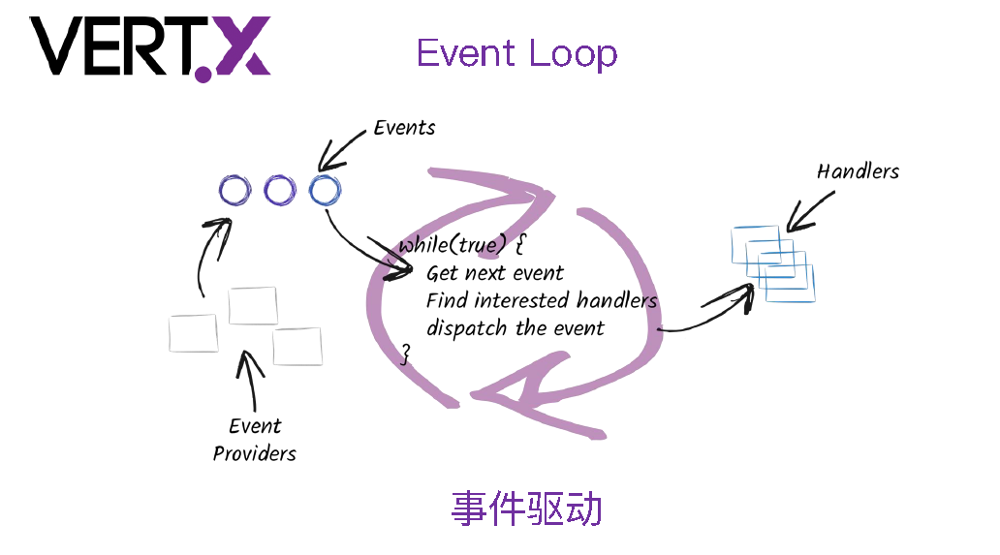
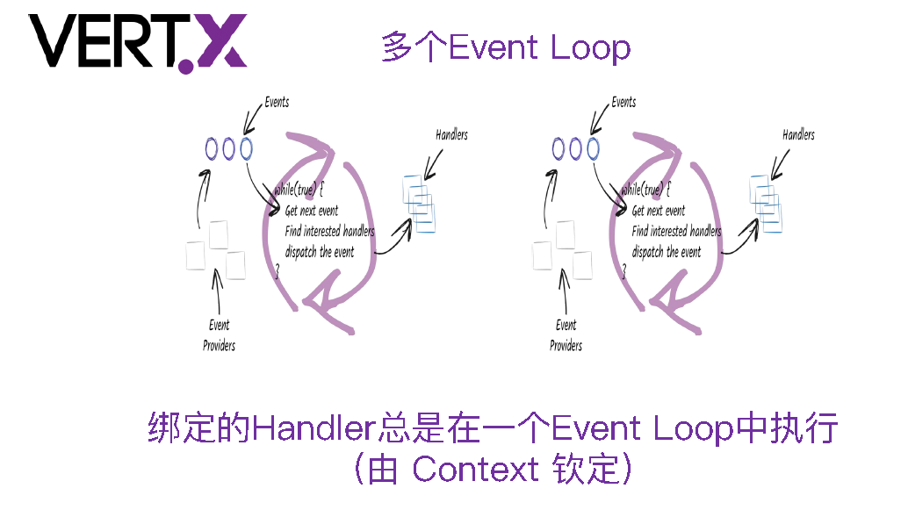
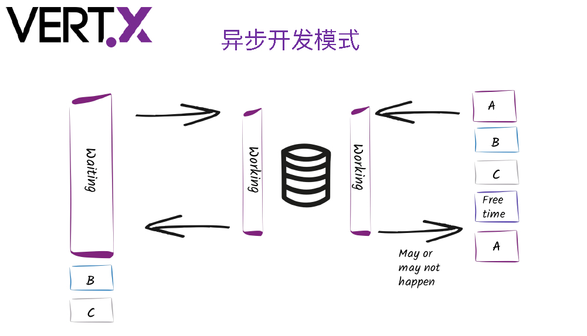
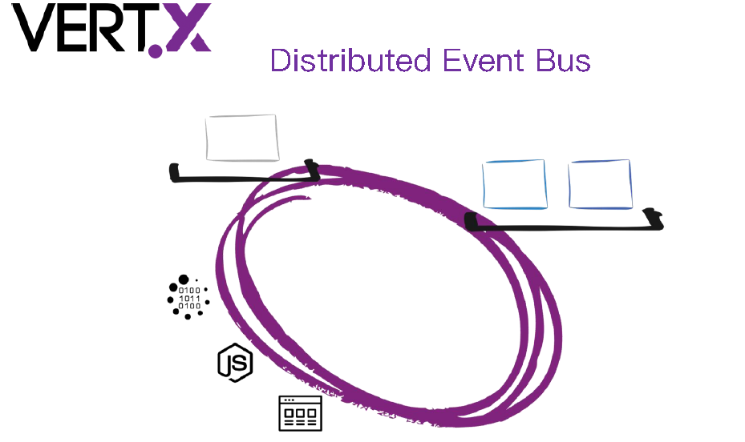
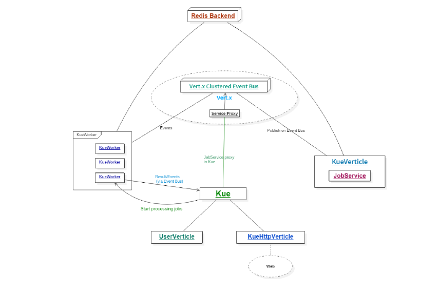
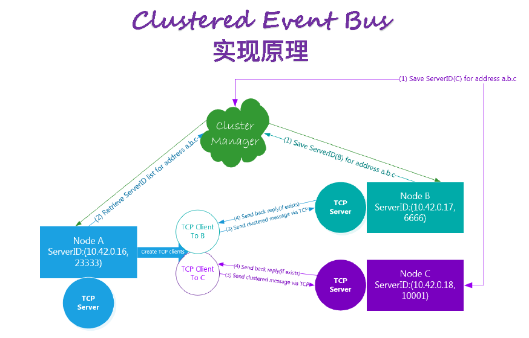
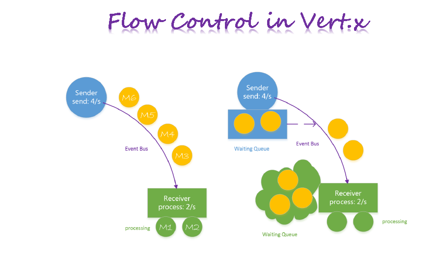
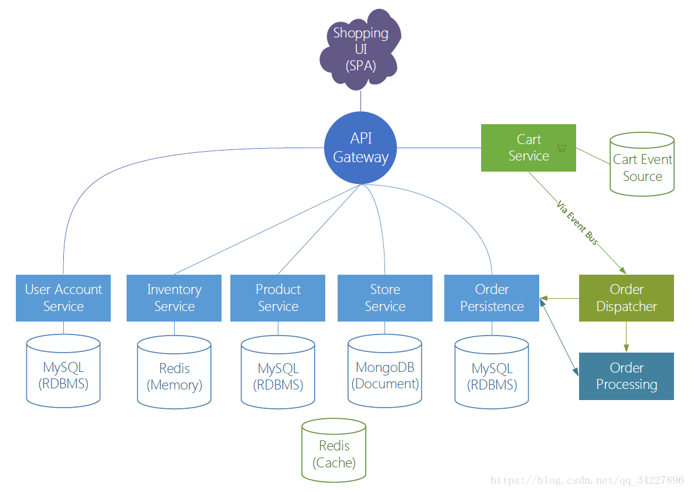
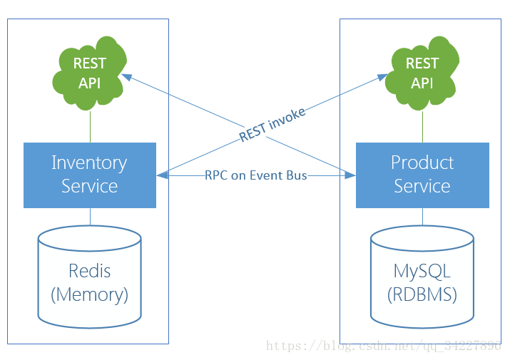

# [vert.x](https://github.com/vert-x3/)

[vertx-awesome](https://github.com/vert-x3/vertx-awesome)

Vert.x诞生于2011年，当时叫node.x，不过后来因为某些原因改名位Vert.x。经过三年多的发展，现在已经到了3.x版本，社区也越来越活跃，在最新的官网Vertx.io上，作者用一句话介绍了它，JVM上的Reative开发套件。Vert.x目前是见过最功能最强大，第三方库依赖最少的Java框架，它只依赖Netty4以及Jacskon，另外如果你需要建立分布式的Vert.x则再依赖HazelCast这个分布式框架，注意Vert.x3必须基于Java8。由于基于JVM，所以Vert.x可以用其他语言来实现你的业务。默认官方维护的语言是Groovy，JavaScript以及 JRuby。

Vert.x是一个异步无阻塞的网络框架，其参照物是node.js。基本上node.js能干的事情，Vert.x都能干。Vert.x利用Netty4的EventLoop来做单线程的事件循环，所以跑在Vert.x上的业务不能做CPU密集型的运算，这样会导致整个线程被阻塞。

**Vert.x是基于事件的，提供一个事件驱动编程模型**，使用Vert.x作为服务器时，程序员只要编写事件处理器event handler即可. 当TCP socket有数据时，event handler理解被创建调用，另外它还可以在以下几种情况激活： '当事件总线Event Bus接受到消息时,' '当接收到HTTP消息时,' 当一个连接断开时',' '当计时器超时时.'

作为服务层处理逻辑这一层基本上对应的传统Java里的领域模型处理层.各种Service调用,以及对数据层的调用.差不多是一个承上启下的一层.传统的模型里,这一层基本上都是同步调用,即使有异步调用,也是与业务逻辑分离的异步.如果全异步会导致业务逻辑碎乱.代码很难描述清楚.到这里你会发现Vert.x其实不太好融合到业务性很强的服务层里.其主要原因如下
* 1、自身是异步体系,不适合描述顺序逻辑性强的业务
* 2、由于异步的问题,访问数据层也必须是异步,导致业务模型进一步碎片化.

* 1、同时支持多种编程语言——目前已经支持了Java、Scala、JavaScript、Ruby、Python、Groovy、Clojure、Ceylon等。对程序员来说，直接好处就是可以使用各种语言丰富的LIB，同时也不再为编程语言选型而纠结；

* 2、异步无锁编程——经典的多线程编程模型能满足很多Web开发场景，但随着移动互联网并发连接数的猛增，多线程并发控制模型性能难以扩展，同时要想控制好并发锁需要较高的技巧，目前Reactor异步编程模型开始跑马圈地，而Vert.x就是这种异步无锁编程的一个首选；

* 3、对各种IO的丰富支持——目前Vert.x的异步模型已支持TCP、UDP、FileSystem、DNS、EventBus、Sockjs等；

极好的分布式开发支持——Vert.x通过EventBus事件总线，可以轻松编写分布式解耦的程序，具有很好的扩展性；

* 4、生态体系日趋成熟——Vert.x归入Eclipse基金会门下，异步驱动已经支持了Postgres、MySQL、MongoDB、Redis等常用组件，并且有若干Vert.x在生产环境中的应用案例。

## Vert.x提供的核心API
* HTTP/HTTPS Server/Client
* Websocket SockJS
* TCP/SSL Server/Client
* UDP / DNS
* Files / Timer
* Json / Buffer / Flow Control
* EventBus ( 集群 )
* Distribution (Lock, Map, Counter)

* 开发模型/线程模型
* Verticle之间进行通信: Event Bus
* 逻辑单元：Verticle(Actor-like)
* Event Loop线程：处理事件（不能阻塞！）

## Worker线程：可执行阻塞任务

* 异步开发模式

## Event Bus
* Vert.x的神经系统(各组件之间通信)
* •每个消息都会被发送至某个地址(address)
* •消息会在消息接收者绑定的Handler中进行处理

* •多种消息模式

* Event Bus Clients && Bridges
## Reactive Pattern
Vert.x默认都是基于回调的API ——Nightmare!

* •Observable(Rx-fiedAPIs)
* •Vert.x Sync (Fiber)
* •Future(map/compose)

## Vert.x KueVert.x Kue

一个使用Vert.x开发的优先级工作队列，数据存储使用的是Redis。Vert.x Kue是Automattic/kue(Node.js)的Vert.x实现版本。

## Clustered Event Bus实现原理
* •基于TCP
* •底层通过Cluster Manager同步ServerID
* •消息协议：一种简单的Wire Protocol

## API-Gateway

